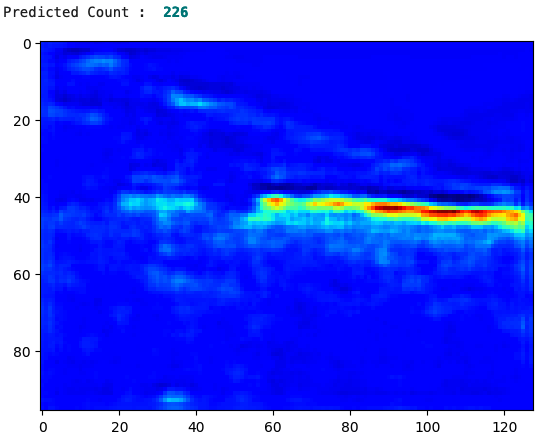

# crowd_counting
A model that estimates the number of people present.

# Project Objective
Having the capability of determining the number of people in an image is a useful feature in areas such as crowd management, meeting occupant safety capacity, determining line wait times, and much more. This model is given an image and creates a density map along with a predicted count of the people present in the image. 

# Environment
- CUDA 12.0
- Python 3.8.10
- Jupyter Notebook
  
# Data
The data for this project comes from ShanghaiTech and was originally cited in the CVPR 2016 paper <ins>Single Image Crowd Counting via Multi Column Convolutional Neural Network</ins>. Each dataset contains the images in jpg format, the ground-truth matlab file, and the ground-truth-h5 people density map. The full dataset can be found at https://www.kaggle.com/datasets/tthien/shanghaitech-with-people-density-map/code.

# Model
This model's architecture comes from the paper *CSRNet: Dilated Convolutional Neural Networks for Understanding the Highly Congested Scenes*. This architecture passes the image through four additional layers of convolutions after going through the standard VGG-16 backbone. The output is passed through one of the four configurations before going through the final 1x1x1 convolutional layer. The mean squared error loss minimization is performed on the output image to get the optimal weight values while keeping track of the crowd count using mean absolute error. All convolutional layers are dialated at a rate of two.

# Inference
An image was selected and normalized so that it could be passed into the model for evaluation. The model output a density map of the image along with the predicted count of people included in the image. 

